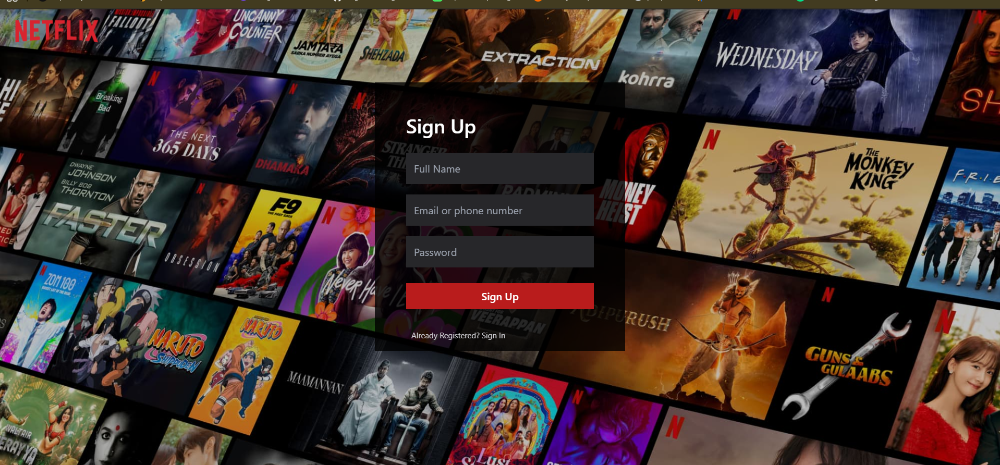
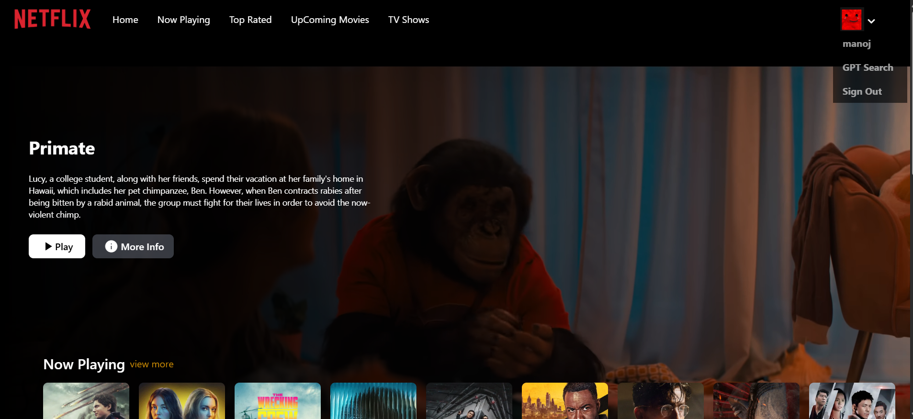
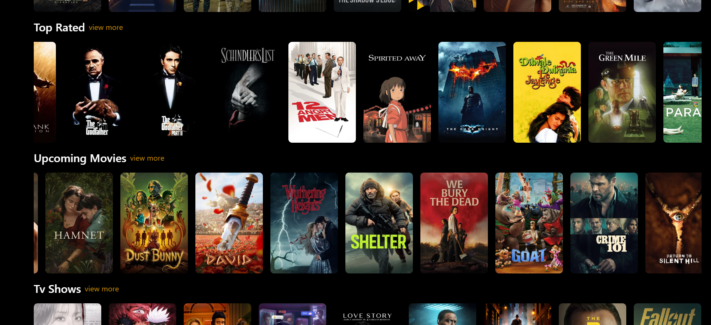
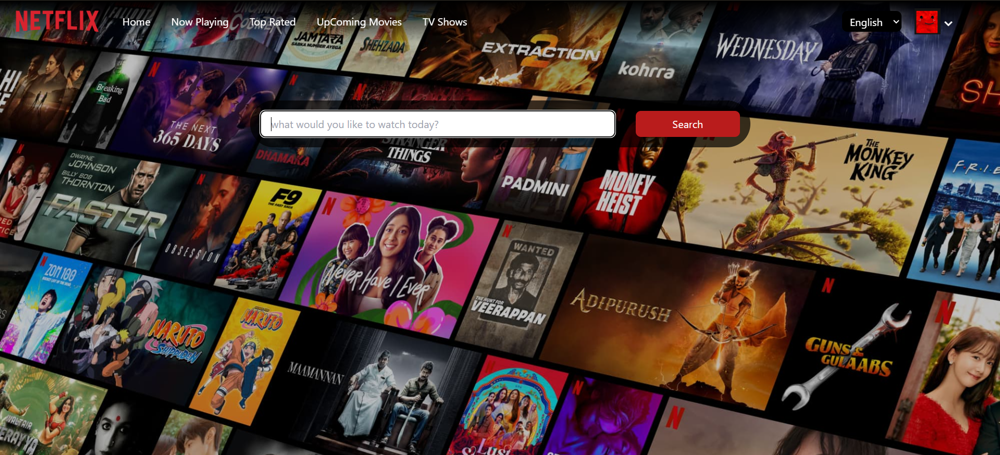
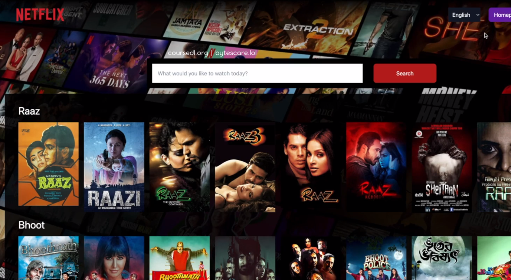

# NetflixGPT 
- create react + vite
- configure Tailwind CSS
- Header
- Routing of app
- Login Form
- Sign up form
- form submission and validation using useRef
- Google Firebase setup 
- deployment in firebase(still pendingg....)
- create singup user account
- adding signup and signin
- redux store with userslice
-  implemented signUp
- Bugfix: if user not logged in -automatically redirect to login page and viceversa
- we unsubscribed on OnAuthStateChanged
- Register TMDB API & create an app & get access token
- Get Data from TMDB now playing movies list and adding it to Redux store 
- custom hook for now playing movies
- Browse page -> MainContainer
                    - videoBackground
                    - Video Title
                SecondaryContainer
                    -movieList * n
                    - cards * n
- fetch data and trailer video
- update store with trailer video data
- embedded the youtube video and make it autoplay in background
- styling mainContainer using tailwind class
- Building Secondary container
- fetching list of movies(popular,trending..)
- displaying them in horizontal rows with smooth scroll
- GPT Search feature

...
# features
- Login/Sign Up
    - Sign In/Sign up Form  -> validation to these forms
    - redirect to Browser Page
- Browse (only after the succesful login)
    - Header
    - Main Movie
        - trailer in background
        - title and description
        - Movie Suggestions
            - moviesLists 
- NetflixGPT
    - Search Bar
    - Movie Suggestions
      
## Screenshots

## Screenshots

